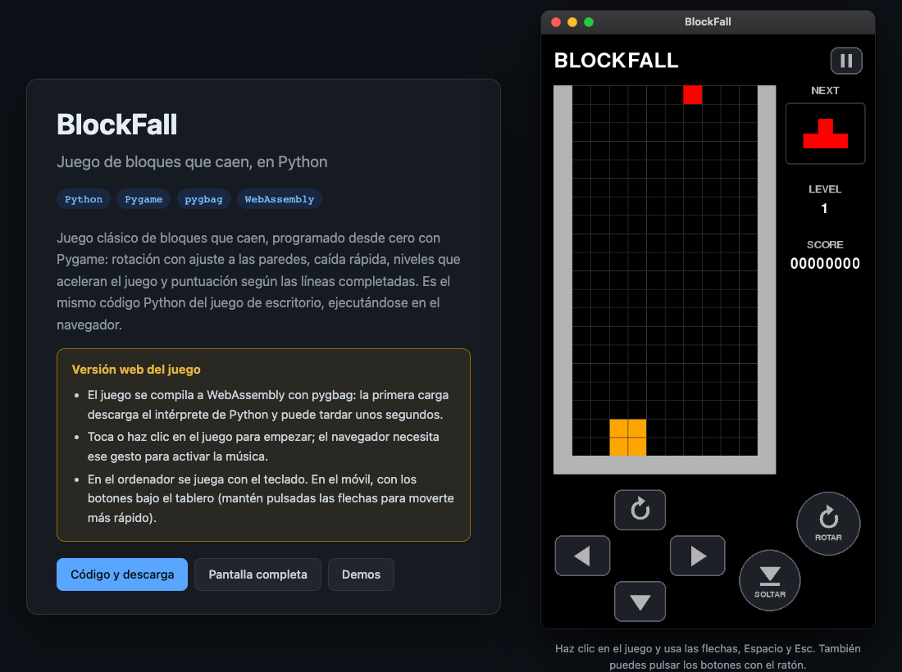

# BlockFall · Demo web

> [!IMPORTANT]
> **Este no es el repositorio principal del juego.**
> Aquí solo está la **versión de demostración web** que se publica en mi web.
> El juego original de escritorio (código fuente, vídeo de la partida e instrucciones para ejecutarlo) está en:
>
> **[RaulEstevezA/BlockFall_Python](https://github.com/RaulEstevezA/BlockFall_Python)**

**Demo en vivo:** [raulesteveza.github.io/demos/BlockFall_Python](https://raulesteveza.github.io/demos/BlockFall_Python/)

<p align="center">
  <a href="https://raulesteveza.github.io/demos/BlockFall_Python/">
    
  </a>
</p>

## Para qué sirve este repositorio

BlockFall es un juego de bloques que caen que programé desde cero en Python con Pygame, pensado para ordenador. Para poder enseñarlo en mi web, este repositorio contiene una copia adaptada que:

1. **Funciona en el navegador.** El código Python se compila a WebAssembly con [pygbag](https://pygame-web.github.io/): es el mismo juego, no una reescritura en JavaScript.
2. **Se puede jugar en el móvil**, con botones táctiles bajo el tablero.
3. **Se despliega solo**: cada push a `main` ejecuta los tests, compila el juego y lo publica con GitHub Actions.

En el ordenador, la demo se muestra dentro de una ventana de macOS y se juega con el teclado; en el móvil, a pantalla completa con los botones.

## Diferencias con el juego original

| | Juego original ([BlockFall_Python](https://github.com/RaulEstevezA/BlockFall_Python)) | Esta demo |
|---|---|---|
| Plataforma | Escritorio (Windows / macOS) | Navegador (escritorio y móvil) |
| Ventana | Horizontal, 1300 × 800 | Vertical, 540 × 960 (formato móvil) |
| Controles | Teclado | Teclado, ratón y botones táctiles |
| Bucle principal | Síncrono, con bucles de espera en game over y configuración | Asíncrono (`asyncio`), sin bucles bloqueantes, como exige pygbag |
| Biblioteca | `pygame` | `pygame-ce` (la que usa pygbag); el código funciona con ambas |

### Cambios en el código

- **`main.py`** (antes `tetris.py`): el juego pasa a una clase `Game` con un bucle `async` que cede el control al navegador en cada fotograma. Las pantallas de game over y de configurar teclas ya no bloquean el bucle: son estados más del juego.
- **`controls.py`** (nuevo): cruceta, botones redondos de rotar y soltar y botón de pausa, dibujados con formas simples. Admiten varios dedos a la vez, repetición al mantener pulsado y deslizar el dedo de una flecha a otra.
- **Caída rápida**: ahora fija la pieza al instante (antes se fijaba en el siguiente paso de la caída automática).
- **Pausa automática** si se cambia de pestaña o de ventana.
- La lógica del tablero, las piezas, la rotación y la puntuación es la misma del original.

## Música

La música de fondo es **Korobeiniki**, una canción popular rusa del siglo XIX y de dominio público. No usa ninguna grabación ni ningún arreglo de terceros: el sonido se genera desde cero con [`tool/generate_music.py`](tool/generate_music.py) (onda cuadrada para la melodía, triangular para el bajo y ruido para la percusión), usando solo la biblioteca estándar de Python.

```bash
python tool/generate_music.py   # regenera music/theme.ogg (necesita ffmpeg)
```

## Controles

| Acción | Teclado | Móvil |
|---|---|---|
| Mover | ← → | Flechas de la cruceta (mantener para repetir) |
| Bajar | ↓ | Flecha abajo |
| Rotar | ↑ | Flecha arriba o botón «ROTAR» |
| Caída rápida | Espacio | Botón «SOLTAR» |
| Pausa | Esc | Botón de pausa |
| Empezar | Enter | Tocar la pantalla |
| Configurar teclas | C (en el menú) | — |

## Estructura

```
main.py                 Bucle principal asíncrono y estados del juego
board.py                Tablero y panel lateral (siguiente pieza, nivel, puntuación)
pieces.py               Piezas, movimiento y rotación
controls.py             Botones táctiles
menu.py                 Menú, pausa, game over y configuración de teclas
settings.py             Tamaños, colores, controles y puntuación
music/theme.ogg         Música de fondo (generada)
tests/                  Tests del juego sin ventana
web/template.tmpl       Plantilla HTML de pygbag (pantalla de carga y estilos)
web/favicon.png         Icono
tool/build_web.sh       Compilación para web
tool/generate_music.py  Generador de la música
showcase/index.html     Página de presentación con la ventana de macOS
.github/workflows/      Tests, compilación y despliegue automático
```

## Ejecutar en local

Como juego de escritorio:

```bash
pip install -r requirements.txt
python main.py
```

En el navegador:

```bash
pip install -r requirements-web.txt
./tool/build_web.sh --serve
# Abrir http://127.0.0.1:8000
```

> Ábrelo con `127.0.0.1` y no con `localhost`: en `localhost` pygbag busca sus paquetes en su propio servidor de desarrollo y el juego no arranca.

Tests:

```bash
python -m unittest discover tests
```

Para verlo exactamente como queda publicado (página con la ventana de macOS y el juego en `app/`):

```bash
./tool/build_web.sh
mkdir -p /tmp/site/demos/BlockFall_Python
cp -R showcase/. /tmp/site/demos/BlockFall_Python/
cp -R build/blockfall/build/web /tmp/site/demos/BlockFall_Python/app
python3 -m http.server 8000 --directory /tmp/site
# Abrir http://127.0.0.1:8000/demos/BlockFall_Python/
```

## Despliegue

El workflow [`deploy-demo.yml`](.github/workflows/deploy-demo.yml) se ejecuta en cada push a `main` (y manualmente desde Actions):

1. Ejecuta los tests.
2. Compila el juego para web con pygbag.
3. Copia `showcase/` y el juego compilado en `demos/BlockFall_Python/` del repositorio [RaulEstevezA.github.io](https://github.com/RaulEstevezA/RaulEstevezA.github.io), que GitHub Pages publica.

Necesita el secreto de Actions `PORTFOLIO_DEPLOY_TOKEN`: un token *fine-grained* con permiso **Contents: Read and write** solo sobre `RaulEstevezA.github.io`.

La carpeta `demos/BlockFall_Python/` de la web se sustituye entera en cada despliegue, así que no debe editarse a mano.

## Desarrollador

**Raul Estevez**

- [Web personal](https://raulesteveza.github.io/)
- [LinkedIn](https://www.linkedin.com/in/raulesteveza/)

[Volver al README principal](./README.md)
